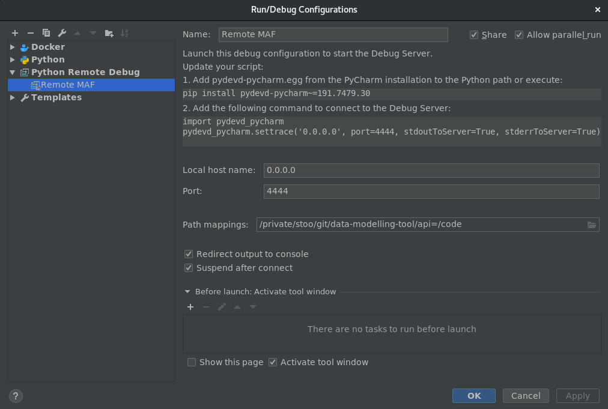

# Marine Analysis Framework API

## API

### Endpoints
```
'/api/transformer/json-schema'
Methods: POST 
Data: 
    POST: form as json
Returns: 
    POST: json-schema

'/api/data-sources/
Methods: POST, GET 
Data: 
    POST: json data-source object
    GET: None
Returns: 
    POST: data-source id
    GET: List of data-source
    
'/api/data-sources/<string:_id>'
Methods: PUT
Data:
    PUT: New data-source json object
Returns:
    PUT: Boolean
```

## Python packages

This project uses [Poetry](https://poetry.eustace.io/docs/) for its Python package management.

* If you like Poetry to create venv in the project directory, configure it like so;  
`poetry config settings.virtualenvs.in-project true`  
* To create a virtual environment run `poetry install`
* To add packages run `poetry add myPackage` (Remember to rebuild the Docker image)

## Debugging

To to be able to debug Python running in a docker-compose environment, we use a "Python Remote Debugger" in PyCharm.
1. Configure a PyCharm debugger

2. Copy your debug-egg to the project root.  
For a JetBrains Toolbox installation;  
`cp ~/.local/share/JetBrains/Toolbox/apps/PyCharm-P/ch-0/191.7479.30/debug-eggs/pydevd-pycharm.egg .`
3. Now it get's a bit weird, because of the way flask handles processes and threads, you first have to start the application with REMOTE_DEBUG = 0 in the config.py file, and then set it to 1. Hot-reloading will then enable debugging in the container.