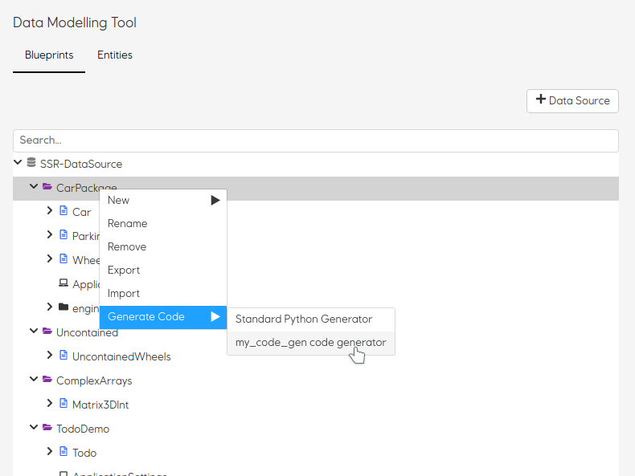

# Marine Analysis Framework API

## Code generator plugins
To use your own code generator, follow these steps;
1. Create a python module (a directory with a `__init__.py`-file)
2. Have the modules `main()` function adhere to the DMT-code-generator-standard
    ```python
    def main(dict_of_blueprints: dict) -> io.BytesIO:
        zip_folder = create_code_from_blueprints()
        return zip_folder
    ```
3. Using docker; mount you'r python module into the container `/code/home/code_generators/`
    ```yaml
    ...
    volumes:
      - ./plugins/awsome_fortran_code_generator:/code/home/code_generators/awsome_fortran_code_generator
    ...
    ```
4. When the DMT-API starts, the plugin is loaded, and offered as an download option on Blueprints and Packages in the DMT Web interface.




## Python packages

This project uses [Poetry](https://poetry.eustace.io/docs/) for its Python package management.

* If you like Poetry to create venv in the project directory, configure it like so;  
```poetry config settings.virtualenvs.in-project true```
* To create a virtual environment run `poetry install`
* To add packages run `poetry add myPackage` (Remember to rebuild the Docker image)

## Running / debugging
Run / debugging configurations for the IntelliJ platform are included.
The target `API` runs `docker-compose up`, and attaches the Python debugger to the `api` container. This allows setting breakpoints in the IDE.
That is, when starting the `API` target, there is no need to run `docker-compose up` in a separate terminal (in PyCharm / WebStorm).
There should not be an issue starting the application from the terminal, though.

No other configuration should be necessary.

There are multiple targets for debugging the client.
Two of which are a work in progress.
`WEB` will start a new Chrome browser, and stops at breakpoints in the code.

## Troubleshooting
#### Intellij Docker issue with pydevd
* Try open idea from terminal. 

Mac:  /Applications/IntelliJ\ IDEA.app/Contents/MacOS/idea

python: can't open file '/opt/.pycharm_helpers/pydev/pydevd.py': [Errno 2] No such file or directory
https://chkr.at/wordpress/?p=227
