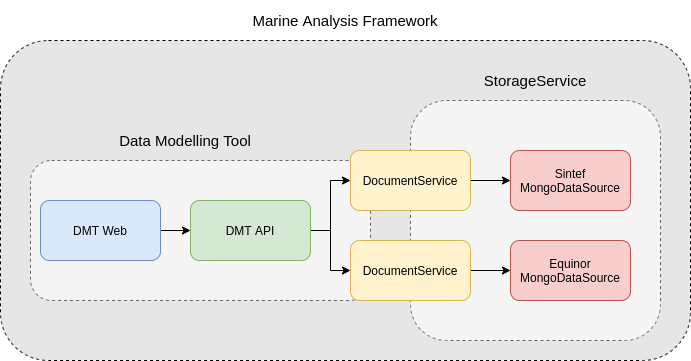

# Architecture

The long term goal of MAF is to have a federated, standardized, and well defined StorageService that can handle the storing and retrieving of data of different nature and requirements.  
 
 For this to work, we need some components with responsibility of different layers of abstraction. All these components will need to support basic CRUD(Crate, Read, Update, Delete) functionality.
 
 
 
## DocumentService
 The DocumentService will get requests like `Fetch document with id 8962045 from the EquinorDataSource`.  
 This can be a complex document, containing references to documents in different DataSources. It will then be the DocumentService's job to construct this document in it's entirety.

## DataSource
 The DataSource, and components to the left of the DataSource, are the "self-hosted" components. Different organizations can setup their own DataSource, which they can control access to.
 The job of the DataSource is to determine which storage backend (Repository) should be used for the data.  
 Here, there are no complex documents, but the DataSource will make choices based on the StorageRecipe tied to the data.
 Requests coming into the DataSource will look something like this; `Fetch document with id 8962045`.  
 
## Repository
This is a plugin based component, that has one interface towards the DataSource, and one to the given storage driver(MongoDB, Postgress, AzureFiles, e.g.)

## Current status
* [x] DocumentService; CRUD on complex documents in the same DataSource
* [x] Repository; MongoDB Repository plugin
* [ ] DocumentService; CRUD on complex documents from different DataSources
* [ ] DataSource: One DataSource can have more than one Repository
* [ ] DataSource: Considers storage preferences based on StorageRecipe
* [ ] DataSource: Supports streaming data

