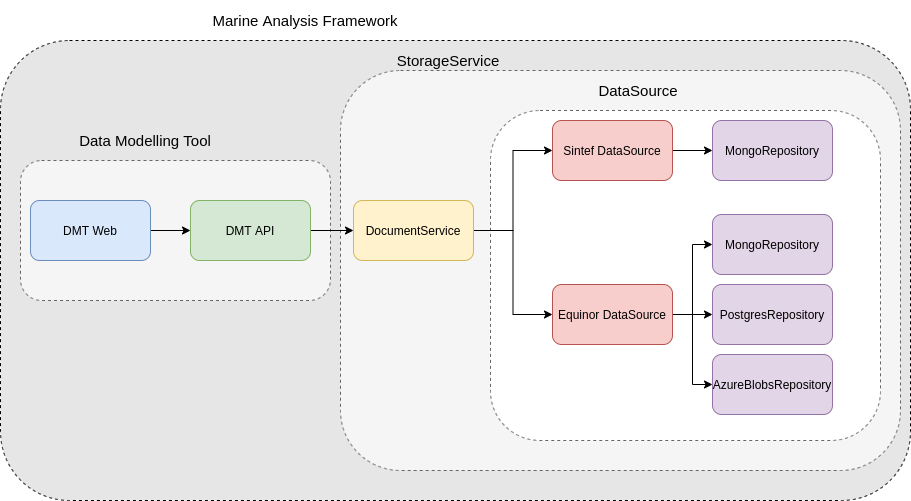
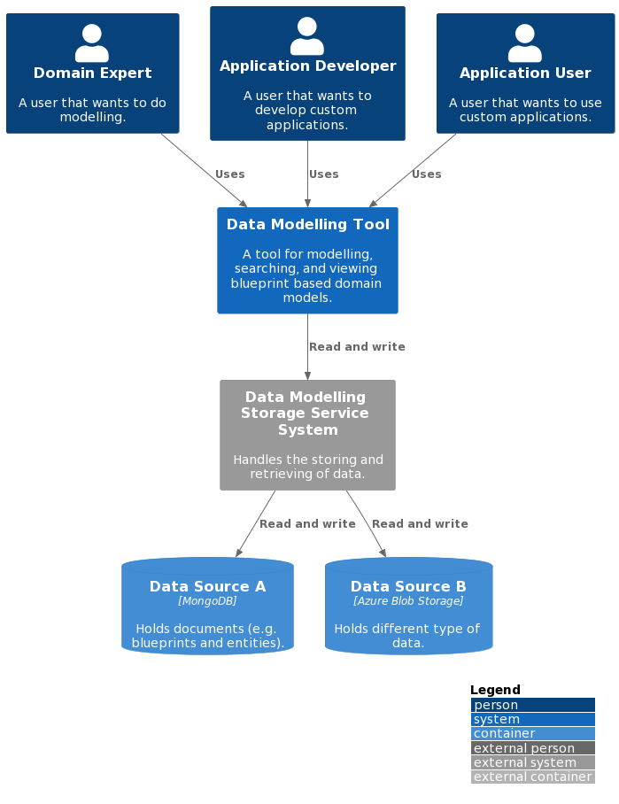
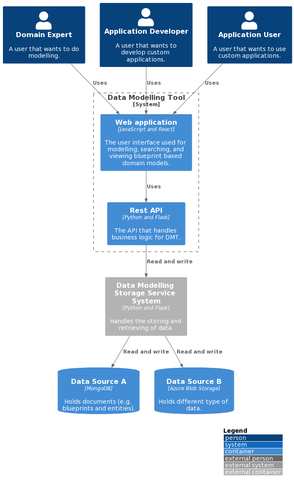
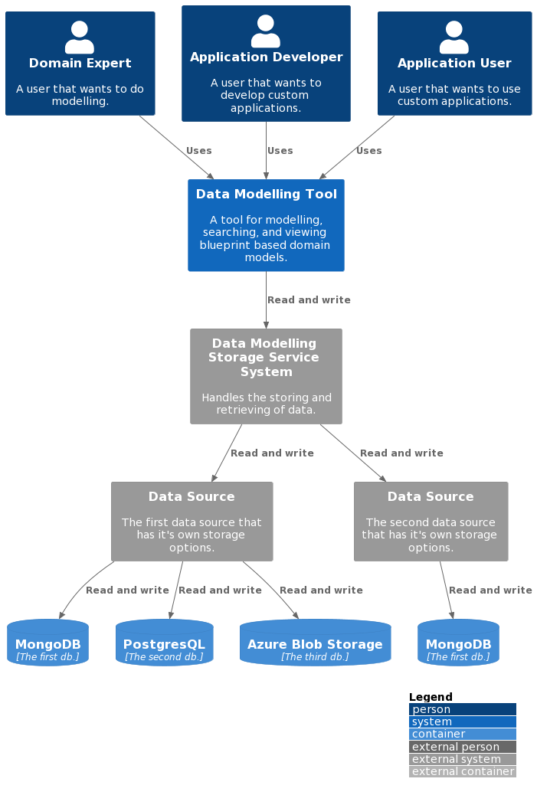

This is a short canned synopsis of architecture.

We follow the Clean Architecture style and structure the codebase accordingly the API.

## Architecture Overview

The long term goal of Data Modelling Tool is to have a federated, standardized, and well defined StorageService that can handle the storing and retrieving of data of different nature and requirements.

For this to work, we need some components with responsibility of different layers of abstraction. All these components will need to support basic CRUD (crate, read, update, delete) functionality.

*DocumentService (Data Modelling Storage Service):*

The Data Modelling Storage Service will get requests like `Fetch document with id 8962045 from the Data Source A`.
 This can be a complex document, containing references to documents in different DataSources. It will then be Data Modelling Storage Service's job to construct this document in it's entirety.

*DataSource:*

The DataSource, and components to the left of the DataSource, are the "self-hosted" components. Different organizations can setup their own DataSource, which they can control access to.
The job of the DataSource is to determine which storage backend (Repository) should be used for the data.
 Here, there are no complex documents, but the DataSource will make choices based on the StorageRecipe tied to the data.
Requests coming into the DataSource will look something like this; `Fetch document with id 8962045`.

*Repository:*

This is a plugin based component, that has one interface towards the DataSource, and one to the given storage driver(MongoDB, Postgress, AzureFiles, e.g.)

## Architecture Diagrams

We are using https://c4model.com for showing architecture diagrams.

### Level 1 - System Context diagram

The Context diagram is a good starting point for diagramming and documenting a software system, allowing you to step back and see the big picture. Here we draw a diagram showing the system as a box in the centre, surrounded by its users and the other systems that it interacts with.

### Level 2 - Container diagram

Once you understand how your system fits in to the overall IT environment, a really useful next step is to zoom-in to the system boundary with a Container diagram. A container is something like a server-side web application, single-page application, desktop application, mobile app, database schema, file system, etc. Essentially, a container is a separately runnable/deployable unit (e.g. a separate process space) that executes code or stores data.

Next is to setup dedicated data sources.

<!---
## Level 3 - Component diagram

Following on from a Container Diagram, next you can zoom in and decompose each container further to identify the major structural building blocks and their interactions.

The Component diagram shows how a container is made up of a number of components, what each of those components are, their responsibilities and the technology/implementation details.
-->

