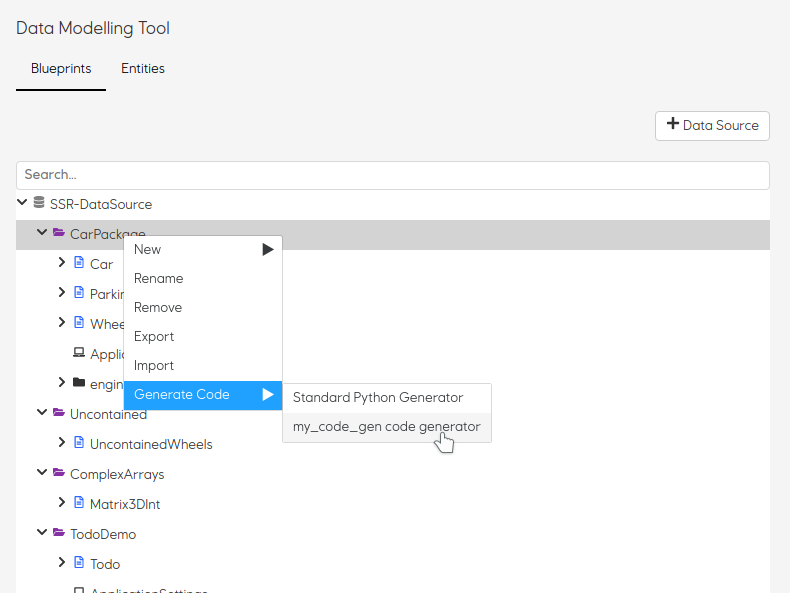

= User Docs
:toc: left
:icons: font
:hide-uri-scheme:
:source-highlighter: rouge

== The Essentials

=== What is Data Modelling Tool?
Data modeling tool (DMT) is a tool for modeling and presentation of data models (based on blueprints). DMT consists of a user interface for creating blueprints and data models, as well as an API for storing, querying, retrieving and sharing data models and their blueprints.

=== Installation

// Be brief, provide links to more detailed documentation

How to get Data Modelling Tool up and running on your machine.

See deployment for notes on how to deploy the project on a live system.

=== Quick usage guide

Be brief, provide links to more detailed documentation

== Part 1 - Core concepts (in-depth)

The data modelling tool is a tool that can be used for modelling complex domain models.

=== What is a Blueprint?

A domain model is called for blueprint.

An instances of a blueprint is called entitiy.

==== A basic blueprint example

Below is a short version of a blueprint for a Car.

[source, json]
----
{
  "type": "system/SIMOS/Blueprint",
  "name": "Car",
  "description": "This describes how a car looks like",
  "attributes": [
    {
      "attributeType": "string",
      "type": "system/SIMOS/BlueprintAttribute",
      "name": "name"
    },
    {
      "attributeType": "string",
      "type": "system/SIMOS/BlueprintAttribute",
      "name": "description"
    }
}
----

It says that a Car can have an attribute `name` and `description`.

So an instance of a Car can look like.

[source, json]
----
{
   "name": "Volvo",
   "description": "This is an typically car type used in Norway"
}
----

==== Blueprint attributes

Any blueprint can be understood by simply looking at its attributes. Each attribute has several options, some are required and other are optional.

.Table Blueprint Attributes
|===
|Attribute|Type|Description

|name|string|Name of the attribute.

|attributeType|string|Type of the attribute. Can be a reference to another blueprint, or a primitive type.

|extends|string|A reference to another blueprint. The blueprint will inherit attributes from referenced blueprint.

|contained|boolean|Describes the conceptual belonging of one entity to another. In other words, if an entity must always be considered in the context of it's "parent" (true), or the entity has meaning on it's own (false).

|dimensions|string|Degree of dimensions. Format; A list of integers, each integer defines the size of a dimension. "*"(wildcard) has the special meaning of "unfixed size".

|optional|boolean|If the attribute is optional or required in the entity

|default|any json|Default value for the attribute. Same type as the attribute itself

|enumType|string|A reference to an Enum entity. Value should hold the chosen enum value in the entity

|inherit|boolean|Property is required in the entity
|===

== Part 2 - Getting started with Modelling

Step-by-step guides for using and mastering the basics of Data Modelling Tool.

=== Modelling blueprints

=== Creating entities

=== Viewing blueprints and entities

=== Searching

== Part 3 - Recipe concept and usage

To express how a model is stored and presented, we use a concept of recipes. Every blueprint can have two kind of recipes in the Data Modelling Tool.

A recipe is just a specific instance of a recipe blueprint, and Libraries, plugins and services can use these recipes to make decisions and therefore become easy to replace.

=== Storage Recipe

A recipe for how to store the data for a blueprint.

Contained means the value is stored in-place, and all primitives are stored with default contained property. However, if a blueprint is referring to another blueprint, then that blueprint can be stored as own independent entity.

=== UI Recipe

A recipe for how to present data.

== Part 3 - Custom applications

=== Creating applications

Right Click a folder in Data Modelling Tool,  select "New Application", and input the name of the application. You also need to specify what packages (blueprints) and entities that should be included in the application. You also specify what models (from the packages included) can be created in the application.

1. Unzip the downloaded file (e.g `unzip application.zip` ).
2. Run `docker-compose up`
3. Visit [http://localhost:9000] in your web browser (Internet Explorer is not supported)

==== Application content

The application content for what's included in zip file will look like this.

[plantuml, format=svg]
----
!include asciidoctor-style.iuml
legend
custom-application
|_ api/ - Backend
   |_ Dockerfile - Contains all the commands for running the backend
   |_ home/ - Contains application settings, blueprints, and entities
|_ web/ - Frontend
   |_ custom-plugins/ - Contains custom plugins
     |_ a-custom-plugin/ - A custom plugin
   |_ config.js - Define what plugins should be loaded
   |_ actions.js - Define custom actions here
   |_ Dockerfile - Contains all the commands for running frontend
|_ docker-compose.yml - Run configuration
|_ ...
end legend
----

=== Adding custom actions

An `Application` blueprint has an attribute with a list of `Action` (s).

Actions are a way of calling custom JavaScript functions with an entity as input.
Useful for calling external systems to do some analysis on an entity.

The object passed to these custom functions looks like this;

[source, typescript]
----
type Input = {
  blueprint: any
  entity: any
  path: string
  id: string
}

type Output = {
  blueprint: any
  entity: any
  dataSource: string
  id: string
  notify?: Boolean
}

updateDocument(output: Output): Function
createEntity(type: string): Function
----

`Input` is the entity the action is being called on, and contains the actual data.

`Output` is where to store the result, and should be passed to `updateDocument()`.

`updateDocument()` is a callBack function that takes the `output` object with a modified `output.entity` value, and saves it.

If `output.notify` is true when passed to `updateDocument()`, the web application will produce a notification on success.

`createEntity()` is a helper function that takes a reference to a blueprint, and returns a default entity of that type.

The `system/SIMOS/Action`-type has four special attributes;

* ActionType

    An enum of the values `["separateResultFile","resultInEntity"]`.
    Decides if the user should be prompt to create a new file that will be passed as the output object to the action, or if the output object should be the same as the input entity.

* Input

    A reference to the type that should be used as input to the action.
    Any entity of this type will have a "Run --> <action_name>" in it's context menu. And a small "play-icon", indicating that is has custom Actions.

* Output

    A reference to the type that should be used for the output entity.

* Method

    The name of the custom function to call within `actions.js` for this action.

==== Current limitations and caveats

* updateDocument is a callBack. That means that if the web-browser get's interrupted (refresh,closed, etc.) the callBack is lost.
* DMSS uses a strict type system, so if the output entity does NOT match the output blueprint, that attribute will not be updated.
* The output object must be left intact, and posted on every updateDocument call. Everything besides the output.entity object should be considered "read-only".

==== Example of `actions.js`

[source, typescript]
----
function sleep(seconds) {
    const ms = seconds * 1000
  return new Promise(resolve => setTimeout(resolve, ms))
}

async function run({ input, output, updateDocument, createEntity }) {
  let entity = {
    ...input.entity,
    // This is an invalid attribute. Will not be saved.
    hallo: 'Hey',
  }
  updateDocument({ ...output, entity })

  // If the browser is interrupted during this sleep, the rest of the function will NOT be executed.
  await sleep(10)
  entity.description = 'a'
  updateDocument({ ...output, entity })

  await sleep(5)
  // Using the passed "createEntity" function, we can get an empty, in-memory entity, of any type.
  let newWheel = await createEntity('SSR-DataSource/CarPackage/Wheel')
  newWheel.diameter = 155
  newWheel.name = 'MyWheel'
  entity['wheels'] = [newWheel]
  output.notify = true
  updateDocument({ ...output, entity })
}

const runnableMethods = {
  run,
}

export default runnableMethods
----

=== Adding custom plugins

Add functionality and customize your applications using custom plugins.

Custom plugins are Node.js packages that implement the DMT APIs (interfaces).

There will be many types of custom plugins, but for now we support only UI plugins.

==== What is a Plugin?

All plugins should be placed under the /custom-plugins folder.

Custom plugins are Node.js packages that implement DMT APIs (interfaces). For larger, more complex custom applications, plugins let you modularize your site customizations into site-specific functionality.

One of the best ways to add functionality to DMT applications is through the plugin system. DMT applications is designed to be extensible, which means plugins are able to extend and modify just about everything DMT does.

Of the many possibilities, plugins can:

* Show custom display for certain documents

==== Loading custom plugins

Add the custom plugins under the /custom-plugins folder like shown here.

[plantuml, format=svg]
----
!include asciidoctor-style.iuml
legend
web/
|_ custom-plugins/
  |_ a-custom-plugin/
    |_ package.json
    |_ src/
      |_ index.tsx
|_ config.js
end legend
----

Add the plugin (package name), e.g a plugin called custom-plugin, into the config.js file like this.

[source, javascript]
----
export default {
  plugins: [
    // These are default included, but can be removed if wanted
    import('@dmt/default-form'),
    import('@dmt/default-pdf'),
    import('@dmt/default-preview'),
    // The extra plugin to be loaded
    import('custom-plugin')
  ],
}
----

Then, build the docker container again, so that the plugin will be installed.

==== Creating own plugins

You may be looking to build a plugin that doesn’t exist yet, or you may just be curious to know more about the anatomy of a custom plugin (file structure, etc).

A package.json is required.

[source, json]
----
{
  "name": "@dmt/custom-plugin",
  "version": "1.0.0",
  "main": "src/index.tsx",
  "dependencies": {
    "@dmt/core-plugins": "x.x.x"
  }
}
----

===== Creating a UI plugin

This is the template for a UI plugin.

[source, jsx]
----
import * as React from 'react'
import { DmtPluginType, DmtUIPlugin } from '@dmt/core-plugins'

export const pluginName = 'custom-plugin'
export const pluginType = DmtPluginType.UI

export const PluginComponent = (props: DmtUIPlugin) => {
  return (
    

      Plugin content goes here!
    

  )
}
----

Everything returned from the PluginComponent will be rendered.

The UI plugin recipes will use the pluginName in the plugin field, which means that this UI recipe will use that plugin, like this.

[source, json]
----
{
  "uiRecipes": [
    {
      "name": "A custom view",
      "type": "system/SIMOS/UiRecipe",
      "description": "This shows a custom view",
      "plugin": "custom-plugin",
      "options": [],
      "attributes": []
    }
  ]
}
----

== Part 4 - Code Generators

Data Modelling Tool can generate code from your blueprints. This is useful for being able to programmatically interact with your models. For example; creating 10k entities of a complex model based on data from an Excel sheet.

If you also need storage for your models, or making them available for searching and viewing in the DMT web application, https://equinor.github.io/dmt-py/[Data Modelling Tool Python3 Library] can help with that.

=== How to generate code?

To download generated code for some blueprints;

1. Navigate to the "Blueprints" page in the app
2. Right-click any package or blueprint
3. Select "Generate Code" and choose your code generator

=== Add custom code generators

Data Modelling Tool currently ships with one Python3 code generator ((/api/home/code_generators/default_python/README.md).

This might not suit your needs (either you need a different language, or some special feature on the code itself), so Data Modelling Tool supports plugable code generators. The code generators can be written in any language, and generate code in any language.

To use your own code generator, follow these steps;

1. Create a python module (a directory with a `__init__.py`-file)
2. (Optional) Create the files called
   * `NAME.txt` with a single line with the desired display name.
   * `README.md` with a description, and usage of the plugin, along with other relevant information
3. Have the modules `main()` function adhere to the DMT-code-generator-standard

[source, python]
----
import io

def main(dict_of_blueprints: dict) -> io.BytesIO:
    """Entry point of the code generator"""
    ...
----

Input: A dictionary of all the blueprints referenced in the selected package/blueprint, in their entierty.

[source, python]
----
{
   "SSR-DataSource/CarPackage/Car": {
      "name": "Car",
      "type": "system/SIMOS/Blueprint",
      ...
   }
   "system/SIMOS/Blueprint": {
      ...
   }
}
----

Output: A zip folder of the `io.BytesIO`-class
Example;

[source, python]
----
import io
import zipfile

def main(list_of_blueprints):
   memory_file = io.BytesIO()
   with zipfile.ZipFile(memory_file, mode="w") as zip_file:
      zip_file.writestr("python-code.py", str(list_of_blueprints))

   # Important to do, otherwise the file will look empty
   memory_file.seek(0)
   return memory_file
----

4. Using docker; mount your python module into  `/code/home/code_generators/`

[source, yaml]
----
 ...
 volumes:
   - ./plugins/awesome_fortran_cg:/code/home/code_generators/awesome_fortran_cg
----

5. When the DMT-API restarts, the plugin is loaded, and offered as an option on "Generate Code".

// == Copyright and licensing information

// == Author(s)

// == Thanks, acknowledgements, and credits

// == Basic contact and help information

// Provide links

// == Bugs

// * List of known bugs
//  * Instructions on reporting new bugs

// == Changelog

// == Basic contributing instructions

//Participate by submitting xref:user-manual/submit-pull-request.adoc[pull requests] or xref:user-manual/report-issue.adoc[filling issues].

== How to contribute?

We welcome anyone who would like to join and contribute.

Please see our xref:contribute-guide.adoc[contribute guide].
