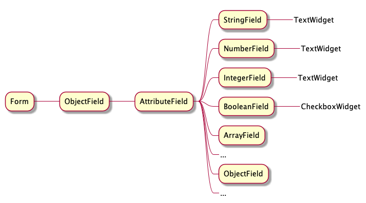

# Form

>  Generate forms from Blueprints

## API

### form(type, formData)

#### type

Type: `string` 
Optional: `true`

The blueprint to generate form of.

#### formData

Type: `object`
Optional: `true`

The initial state.

## Fields and widgets 

The form is made up from fields and widgets:

The attribute field selects correct fields for each attribute.
